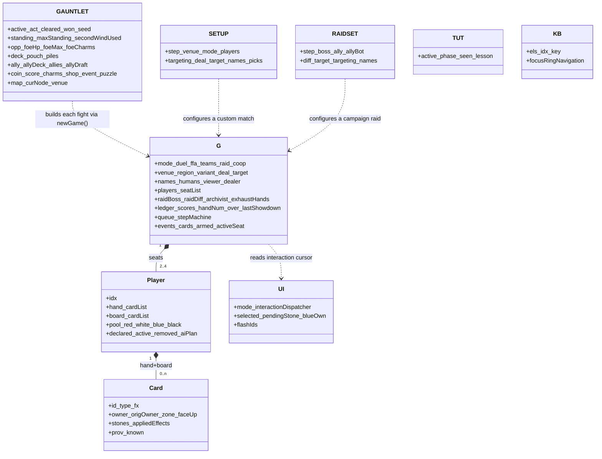
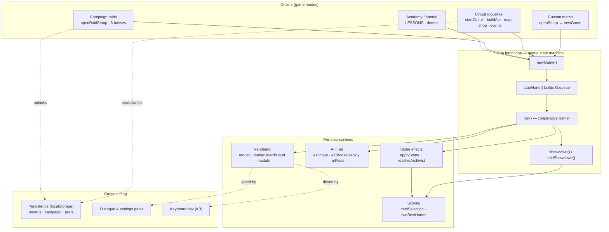
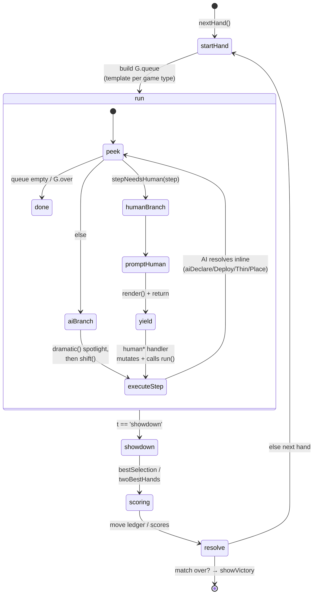
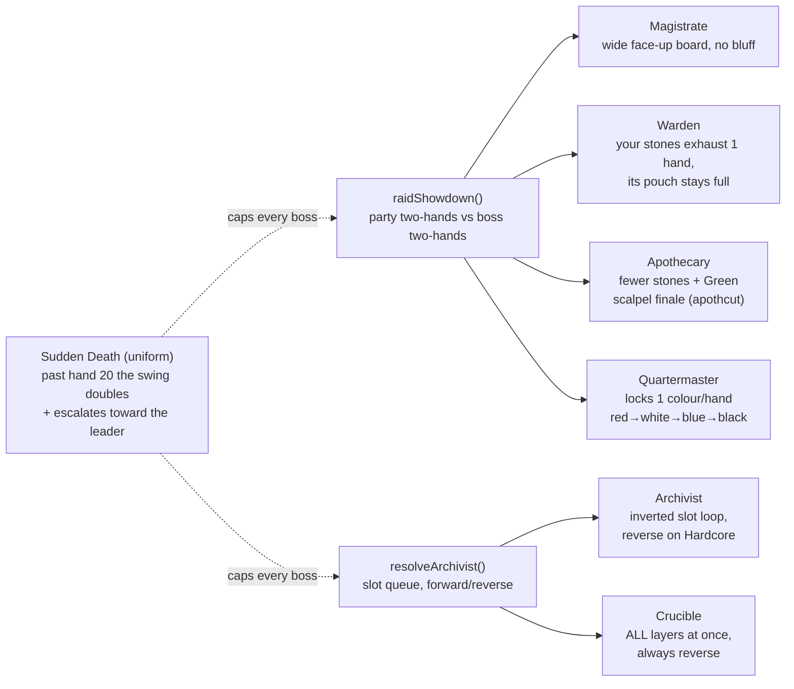

# Stonelock — Architecture Map

> A "UML" for a codebase that isn't object-oriented. Stonelock (`game.js`, ~8.4k
> lines) is **functional**: pure-ish functions over a few big **global state
> objects** and a wall of **const data dictionaries**, all driven by a
> **queue-based hand state machine**. So instead of a class-per-file diagram,
> this captures the four things that actually describe it: the *state shapes*,
> the *subsystems*, the *hand loop* (the core pattern), and the *raid-boss
> variation*. Line numbers refer to `game.js`.

Entry points: `boot()` on `DOMContentLoaded` in the browser; a `module.exports`
test API under Node (guarded by `typeof module`).

---

## 1. State shapes — the objects everything mutates

There are no domain classes; there are a handful of long-lived mutable objects.
`G` is the per-match world; `GAUNTLET` is the Circuit run that *wraps* matches;
`UI` is the interaction cursor; the rest are screen/session state.

---

## 2. Subsystems — the function clusters

Ten clusters. Everything funnels through the **core hand loop**: Circuit and
Campaign are *drivers* that call `newGame()` and read the result; scoring, stone
effects, AI, and rendering are *services* the loop leans on each step;
persistence and dialogue are cross-cutting.

---

## 3. The hand loop — the core pattern

This is the heart of the whole codebase and the answer to "what patterns you've
got going on": a **cooperative coroutine over a work queue**. `startHand` picks
a queue *template* by game type and fills it with typed step objects
(`{t:'declare'|'deploy'|'place'|'thin'|'showdown'|…}`). `run()` walks the queue;
**AI seats resolve inline**, **human seats yield to the DOM** (the loop
`return`s; a `human*` handler mutates state and calls `run()` again). No blocking
— the browser event loop is the scheduler.

Queue templates (the `else-if` ladder in `startHand`): **Standard** (declare →
deploy across Foundation/Veil/Final → thin → two place rounds → showdown),
**Raid Magistrate** (round-table deploys → telegraph → interleaved places, boss
last), **Archivist/Crucible** (stones onto empty slots first → commit cards →
`archresolve` forward *or* reverse), plus Gauntlet, Circuit, Precedence, and
Academy variants.

---

## 4. Raid bosses — one engine, six behaviours

All six campaign bosses share `raidShowdown` (party = seats 0+2 vs boss's two
best hands). Four of them just tune stone economy; the **Archivist** and
**Crucible** swap in a whole different resolution engine (`resolveArchivist` —
stones queue onto flat slots and fire in placement order, or reversed).

---

## Notes for readers

- **Seeded RNG** (`seedRng`/`rnd`) makes Circuit runs reproducible (daily/shared
  seeds) and every battery/test deterministic.
- **`module.exports`** exposes the pure logic plus internal accessors
  (`_state`, `_ui`, `_gauntlet`, `_run`, `_ai`, `_personas`) so the `tests/`
  batteries can drive full all-AI matches headlessly — that's how balance
  (win-rates, turn-counts, map structure) is measured, not guessed.
- **Structure rules** (Circuit map generation) and **balance constants**
  (`CIRCUIT`, `RAID_DIFFS`, `CIRCUIT_MIN/MAX_FIGHTS`, `RAID_SUDDEN_DEATH`) are
  centralised so tuning is a small, testable surface rather than scattered magic
  numbers.
