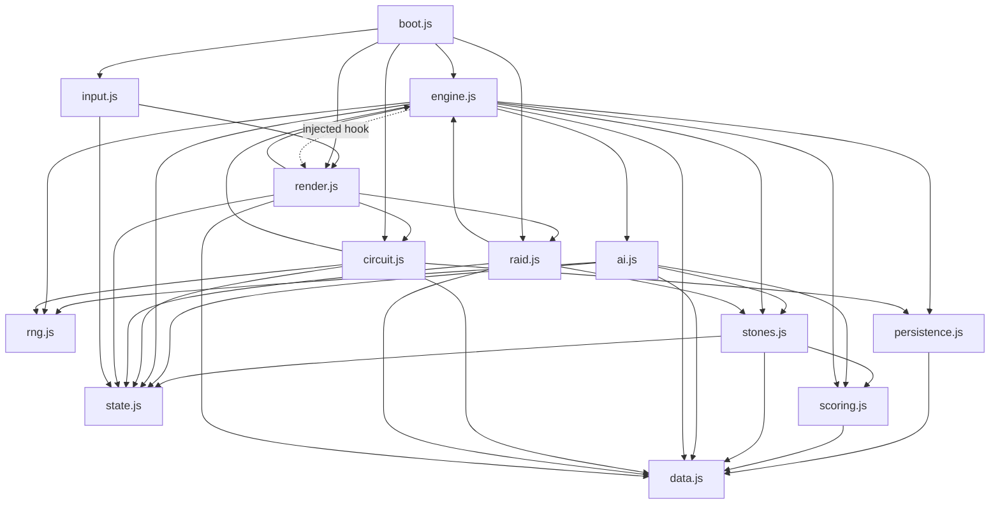

# Stonelock — Modularization Plan (proposal, no code moved yet)

> Patrick's structural read was positive; the caveat was **scale**: an 8.4k-line
> `game.js` with shared global state accrues coupling bugs and can't be reasoned
> about a subsystem at a time. This plan draws the **seams** to fix that —
> *keeping* the architecture (his approval says the bones are good), not
> rewriting it. Goal: shrink the blast radius of any change and let each
> subsystem be understood, tested, and edited alone.

**Nothing here changes behaviour.** Same game, same tests' assertions, same
**no-build-step** deployment. It's a physical reorganisation, done in phases
that keep the whole test suite green after every step.

---

## 1. Non-goals (what this plan explicitly does NOT do)

- ❌ No rewrite, no new framework, no TypeScript, no bundler/build step.
- ❌ No behaviour change — every existing test asserts the same thing afterwards.
- ❌ No "big bang." It's incremental; at no point is the suite red for more than
  one focused edit.

---

## 2. Target module map

Split `game.js` into ~12 ES modules under `src/`, grouped by the ten clusters
the architecture survey already identified. The one hard problem is **shared
mutable state** (`G`, `GAUNTLET`, `UI`, …); it gets its own module so ownership
is explicit and every other module reads/writes it through one door.

| Module | Holds | Depends on |
|---|---|---|
| `data.js` | All const dictionaries: STONES, TYPES, REGIONS/VENUES, CHARMS, PUZZLES, PERSONALITIES, CIRCUIT, RAID_*, MAP_*, dialogue tables | — (leaf) |
| `rng.js` | Seeded RNG: `seedRng`, `rnd`, `clearRng`, `dailySeed` | — (leaf) |
| `state.js` | The mutable singletons object `S = { G, GAUNTLET, UI, SETUP, RAIDSET, TUT }` + tiny accessors | — (leaf) |
| `persistence.js` | localStorage shim + `circuitRecords`, `campaignBeaten`, `dialoguePrefs`, `inputMode` (+ setters) | data |
| `scoring.js` | `bestSelection`, `twoBestHands`, `scoreOptsFor`, `applyCardEffects`, struct ranking | data |
| `stones.js` | `applyStone`, `resolveArchivist` (Archivist engine), predicates (`isLocked`, `hasRed`, `isPoisoned`) | data, scoring, state |
| `ai.js` | The `_ai` cluster: `estimate`, `aiChooseDeploy`, `aiStonePreference`, `aiPlace`, target pickers, `archAi*` | data, scoring, stones, state, rng |
| `engine.js` | **Core hand loop**: `newGame`, `startHand` (queue templates), `run`/`executeStep`/`stepNeedsHuman`, `showdown`, `raidShowdown`, the `human*` handlers, Sudden Death | data, scoring, stones, ai, state, rng, persistence |
| `circuit.js` | Roguelike: `buildAct`/`linkColumns`/map, shop, events, rewards, Standing, piles, structure rules | data, engine, state, rng, persistence |
| `raid.js` | Campaign specifics beyond the shared queue: Archivist/Crucible slot helpers, boss mechanics | data, engine, stones, state |
| `render.js` | All DOM: `render`, `renderBoard/Hand/Score`, modals, screens, `announce` | engine, circuit, raid, data, state (reads) |
| `input.js` | Keyboard nav (`KB`), input-mode toggle | state, render |
| `boot.js` | `boot()`, event wiring, entry point | everything (top of the tree) |

---

## 3. Dependency graph (must stay a DAG — no cycles)

The critical rule that keeps it testable: **`engine` never imports `render`.**
The engine already calls rendering behind `typeof document` guards; that becomes
an injected hook (`engine.onRender = render`) so the engine stays headless and
the batteries keep driving it with no DOM. Rendering is a *consumer* of the
engine, never the reverse.

Leaves (`data`, `rng`, `state`) have zero dependencies — they migrate first and
safely. `render`/`boot` sit at the top and migrate last.

---

## 4. Mechanism: native ES modules (still no build step)

- Browser: `index.html` loads one entry — `<script type="module" src="src/boot.js">` —
  and the import graph pulls in the rest. **Works on GitHub Pages as-is** (static
  files, no bundler).
- Node tests: switch `require(...)` → `import`, run under Node ESM. The existing
  `module.exports` test API becomes named `export`s; the `_state`/`_ai` internal
  accessors are preserved so the batteries drive the real logic unchanged.
- **Shared mutable state** — the one subtlety. Because `newGame` *reassigns* `G`,
  a plain `export let G` can't be reassigned by an importer. So `state.js`
  exports a single object `S` and everyone uses `S.G` / `S.GAUNTLET`. This is the
  bulk of the mechanical churn (a careful `G` → `S.G` pass) but it's the thing
  that makes ownership explicit — which is exactly the coupling risk Patrick
  named.

*(Alternative considered: multiple ordered `<script>` tags on a `window.SL`
namespace — no import syntax, but pollutes global and keeps load-order fragility.
ES modules is cleaner and just as buildless, so it wins.)*

---

## 5. Migration phases (suite green after each)

Each phase moves one leaf-ward slice, updates imports, runs the full suite, commits.

1. **Scaffold** — create `src/`, add the ESM entry to `index.html`, dual-load
   during transition. Move the pure leaves: `data.js`, `rng.js`. (Zero logic
   risk.)
2. **State module** — extract `state.js` and do the `G` → `S.G` pass. Biggest
   mechanical step; the batteries are the safety net (they exercise every state
   field).
3. **Pure logic** — `scoring.js`, then `stones.js`. Both are well-covered by
   existing tests (`scoring.test.js`, `archivist.test.js`).
4. **AI** — `ai.js` (covered by `effects-ai.test.js` + the batteries).
5. **Engine** — `engine.js`, wiring the `onRender` injection hook. Covered by
   `rules`, `raid`, `precedence`, `crucible`, `simulate` tests.
6. **Mode drivers** — `circuit.js`, `raid.js` (covered by `circuit.test.js`,
   `raid.test.js`, and the batteries).
7. **UI + entry** — `render.js`, `input.js`, `boot.js`. Browser-verified (the
   headless tests don't touch DOM); this is where a manual smoke pass matters.
8. **Cleanup** — delete the old monolith, drop the dual-load shim.

---

## 6. Risk & effort per phase

| Phase | Effort | Risk | Why safe |
|---|---|---|---|
| 1 Scaffold + leaves | Low | Very low | Pure data, no logic |
| 2 State (`S.G` pass) | **High** | Medium | Mechanical but wide; batteries catch any missed rewire |
| 3 Scoring + stones | Med | Low | Strong existing unit tests |
| 4 AI | Med | Low | Battery + effects tests |
| 5 Engine | Med | Medium | Central; `onRender` hook keeps it headless-testable |
| 6 Circuit + raid | Med | Low | Well-batteried |
| 7 Render + boot | Med | Medium | Needs a manual browser smoke pass (no DOM in tests) |
| 8 Cleanup | Low | Low | Deletions only |

The **whole point**: after this, a change to (say) map generation lives in
`circuit.js` and can't silently reach into scoring; a coupling bug has to cross
an explicit import to happen, and the DAG makes those crossings visible. That's
the release-hardening Patrick was pointing at — done as reorganisation, not
rewrite, with the test suite as the guardrail the entire way.
